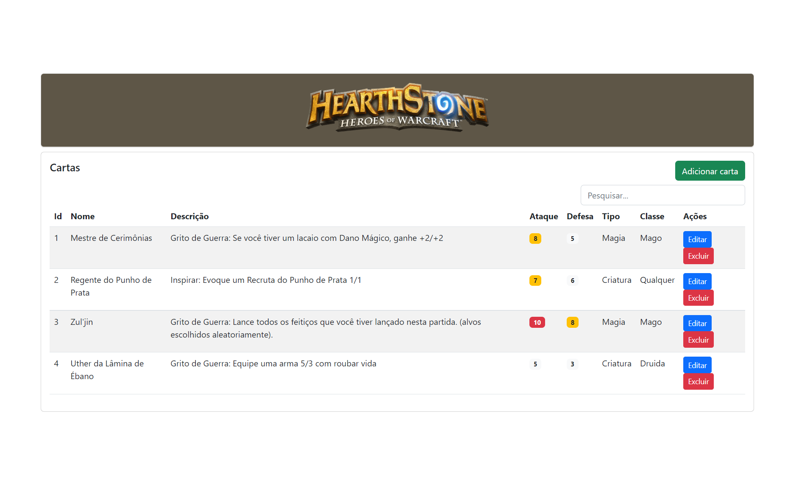
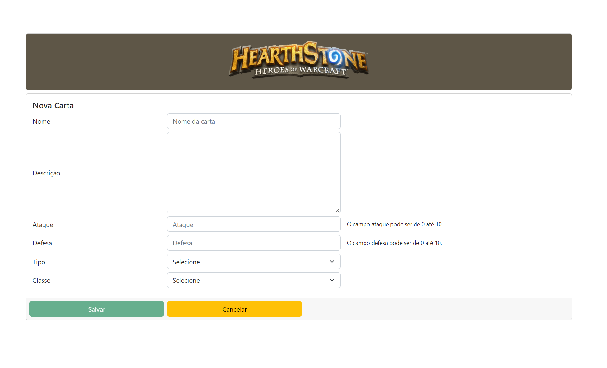
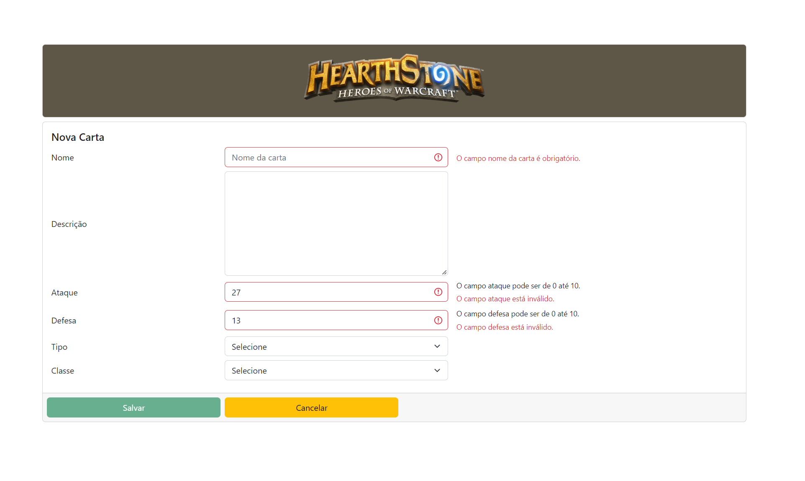

# HearthStone: O Jogo
Projeto para avaliação de aplicação web desenvolvido para processo seletivo de Desenvolvedor Front-end

## Conteúdo
* [Sobre a aplicação](#sobre-a-aplicação)
* [Tecnologias](#hammer_and_wrench-tecnologias)
* [Iniciando a Aplicação](#car-iniciando-a-aplicação)
* [Pré-visualização](#camera_flash-pré-visualização)
* [Licença](#balance_scale-licença)
* [Contato](#email-contato)

## Sobre a aplicação
Este projeto de aplicação foi desenvolvido durante um desafio proposto, para atender os requisitos que foram solicitados durante um período de 3 dias.<br />
A aplicação possui uma tela de manutenção de cartas, cadastro de cartas, contendo um CRUD (inserção, leitura, edição e remoção de dados), que foram armazenados em localStorage.<br/>
É possível acompanhar e filtrar as cartas através do campo de busca.<br/>
Pensado na expansão do projeto, foi construido uma aplicação em __Angular 12__ com validações de usuário, notificações com __Toastr__ e ferramentas projetadas para o futuro da aplicação, como por exemplo: guardião de rotas, serviço de autenticação de usuário para logar/sair da sessão, adição do plugin __Datatables__ dentro do projeto para eventualmente conectar com um servidor back-end, quando for necessário e trabalhar com maior número de dados.<br />
Também foi criado um módulo para organizar a aplicação e um serviço de cartas, para gerenciar o CRUD em localStorage.

## :hammer_and_wrench: Tecnologias
* Front-end
  * __JavaScript + TypeScript__ para codificação da aplicação.
  * __CSS__ para estilização.
  * __Bootstrap v5__ para formato visual da aplicação.
  * __Angular v12__ para validação de formulários e estrutura de projeto.
  * __Datatables__ para futuramente ser utilizado
  * __Toastr__ para exibir notificações no canto da tela.
<br />

## :car: Iniciando a aplicação
Baixe o repositório com git clone e entre na pasta do projeto.<br/>
Instale a aplicação através do comando _npm install_ e logo em seguida rode o servidor através do _ng serve_. É necessário ter o pacote Node instalado na máquina.<br/>
Com o servidor rodando, navegue até a rota _/cartas_

* Instrução de instação
```bash
$ npm install
$ ng serve
$ https://localhost:4200/cartas
```

## :camera_flash: Pré-visualização




## :balance_scale: Licença
Este projeto está licenciado sob a [licença MIT](LICENSE).

## :email: Contato

E-mail: [**rafael.matosr@gmail.com**](mailto:rafael.matosr@gmail.com)
